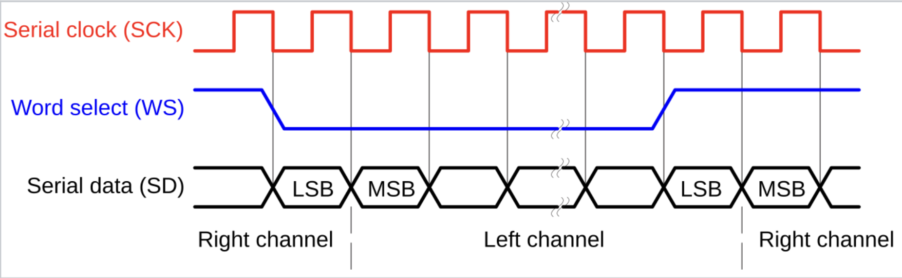

## Speaker calibration device

This is a work in progress embedded project to create a speaker calibration tool and an analyzer. The MCU creates a sinewave sweep that is recorded simultaneously (with an external mic) to an SD card as a WAVE file. 
After analysing the recorded room impulse response, a corrective EQ curve will be provided. In-depth explanation will be in the documents folder in the future.

#### A live demo of current functionality (JAN / 2026)
https://www.youtube.com/watch?v=aHnPGv5U_bM

#### Hardware
| Component name | Description |
|----------|-----------|
|STM32 NUCLEO-F411RE| STM32F411RET6|
|Pmod I2S2 | CS5343 ADC, CS4344 DAC   |
|Pololu-2597 | SD Card breakout board      |
|Wires and Cables| Connections, USB, Audio      |

#### Development tools
- IDE: STM32cubeMX, STM32cubeIDE
- C language (HAL libraries)

## Key Features

### 1. Full-duplex I2S audio streaming

I2S (Inter-IC Sound) is configured in **Full-Duplex Master Mode**, enabling simultaneous transmission and reception.

**Clock Configuration & Pinout:**
Since the STM32F411 acts as the **Controller (master)** and the Pmod I2S2 as the **Target (slave)**, the Master Clock (MCLK) is generated by the MCU. The ADC and DAC sides of the module share the same clock lines, branched from a single MCU pin.

| Signal | Description | Frequency Calculation (Project Specific) |
| :--- | :--- | :--- |
| **SCK** | Serial Clock (Bit Clock) | $48 \text{kHz} \times 16 \text{bit} \times 2 \text{ch} = \mathbf{1.536 \text{ MHz}}$ |
| **WS** | Word Select (Frame Sync) | **48 kHz** (Matches Sample Rate) |
| **SD** | Serial Data (SDIN, SDOUT) | Pulse-code modulation data |
| **MCK** | Master Clock | $256 \times 48 \text{kHz} = \mathbf{12.288 \text{ MHz}}$ |

*Figure 1: I2S Timing protocol (Source: Wikipedia)*

### 2. DMA & Double Buffering
To ensure real-time audio performance without blocking the CPU, **Direct Memory Access (DMA)** is utilized. This allows the I2S peripheral to store and collect data directly from RAM, leaving the CPU free to handle signal generation and file writing.

**The "Ping-Pong" Implementation:**
I configured the DMA in **Circular Mode** and implemented a **Double Buffering** strategy to prevent audio glitches (jitter). The system relies on DMA interrupts to synchronize the data flow:

* **Buffer Split:** The audio buffer is divided into two halves.
* **Half-Transfer Interrupt (HT):** When the DMA finishes filling/reading the *first* half, it triggers an interrupt. The CPU then processes this half while the DMA seamlessly continues to the *second* half.
* **Transfer-Complete Interrupt (TC):** When the DMA finishes the *second* half, a second interrupt allows the CPU to process it while the DMA loops back to the start.

This ensures a continuous data stream.

### 3. Test Signal Generation
The test signal is generated **procedurally in real-time** via code, rather than playing back a file from the SD card.

* **Mechanism:** The MCU calculates a linear sine sweep from 20 Hz to 20 kHz.
* **Hardware Acceleration:** The implementation utilizes the STM32F4's **Floating Point Unit (FPU)** to calculate the sine wave samples efficiently using the standard `sinf()` function.

#### Current state (JAN 2026)
- [x] Test signal is successfully generated 
- [x] Audio recording works, Start/Stop via User Button. (This is basically an audio sampler)
- [ ] **Noise Investigation:**
    * **Loopback Test:** Connecting DAC directly to ADC results in clean audio.
    * **External Interface:** Connecting an external preamp introduces a high noise floor. Currently investigating potential **ground loops**
- [ ] **File System Logic:** Improve FATFS implementation to handle existing files on the SD card (e.g., implement dynamic file naming `rec_001.wav`, `rec_002.wav` to avoid overwrite errors).

### Credits

These sources helped me immensely, and I want to express my gratitude to:

#### I2S, DMA, Double buffering
* [Pmod I2S2 reference manual](https://digilent.com/reference/pmod/pmodi2s2/reference-manual)
* [Phil's Lab - STM32 I2S Audio Setup](https://www.youtube.com/watch?v=zlGSxZGwj-E)
* [YetAnotherElectronicsChannel - DMA & Audio Buffering](https://www.youtube.com/watch?v=lNBrGOk0XzE)

#### SDIO, FATFS
* [DeepBlueEmbedded - STM32 SDIO & FatFs Tutorial](https://deepbluembedded.com/stm32-sdio-sd-card-example-fatfs-tutorial/)
* [Steppe School - SD Card Interfacing with STM32](https://www.youtube.com/watch?v=v9Otedngh24)

#### Roadmap  
- I'm researching if it is possible to do the frequency analysis with the MCU (CMSIS library) or do I need external software for PC
- FFT implementation (initial testing in matlab/octave)
- In depth documentation
